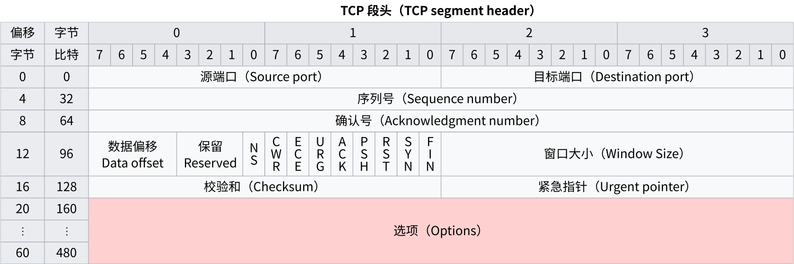

# TCP

## 概述

> Overview

**TCP 传输控制协议**（**Transmission Control
Protocol**）是一种面向连接的、可靠的、基于字节流的传输层通信协议。在简化的计算机网络
OSI 模型中，它完成第四层传输层所指定的功能

## TCP 段结构

> TCP segment structure

### 源端口

> Source port (16 bits)

识别发送端口

### 目标端口

> Destination port (16 bits)

识别接收端口

### 序列号

> Sequence number (32 bits)

- 如果 SYN 标识被设置为（1），那么这是初始序列号。实际第一个数据字节的序列号和相应的
  ACK 确认号是这个序列号加 1
- 如果 SYN 标识被设置为（0），则这是当前会话中此段第一个数据字节的累积序列号

### 确认号

> Acknowledgment number (32 bits)

如果设置了 ACK 标识，则此字段的值是 ACK
发送人期望的下一个序列号。这确认收到所有先前的字节（如有）。每端发送的第一个
ACK 确认另一端的初始序列号本身，但没有数据

### 数据偏移

> Data offset (4 bits)

### 保留

> Reserved (3 bits)

### 标识

> Flags (9 bits)

### 窗口大小

> Window size (16 bits)

### 校验和

> Checksum (16 bits)

### 紧急指针

> Urgent pointer (16 bits)

### 选项

> Options (Variable 0–320 bits, in units of 32 bits)

## TCP 握手

> TCP handshake

TCP 使用**三次握手**（**three-way handshake**）在基于
IP 的网络上建立 TCP/IP 连接

TCP 发送的用于协商和启动 TCP 会话的三个消息分别称为 SYN、SYN-ACK 和
ACK，分别代表 **SYN**chronize、**SYN**chronize-**ACK**nowledgement 和
**ACK**nowledge。三个消息机制的设计是为了让两台想要来回传递信息的计算机可以在传输
HTTP 浏览器请求等数据之前协商连接的参数

主机，通常是浏览器，向服务器发送一个 TCP
SYNchronize 数据包。服务器接收到 SYN 并返回一个
SYNchronize-ACKnowledgement。主机接收到服务器的
SYN-ACK 并发送一个 ACKnowledge。服务器收到 ACK 并建立
TCP 套接字连接

在创建安全连接时，此握手步骤发生在 DNS 查找（DNS
lookup）之后和 TLS 握手（TLS
handshake）之前。连接的每一侧都可以通过四次握手独立终止连接
